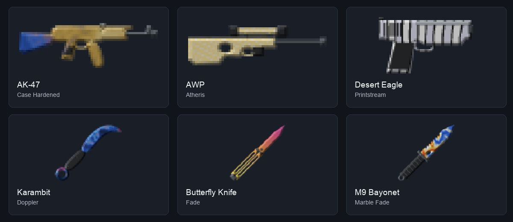
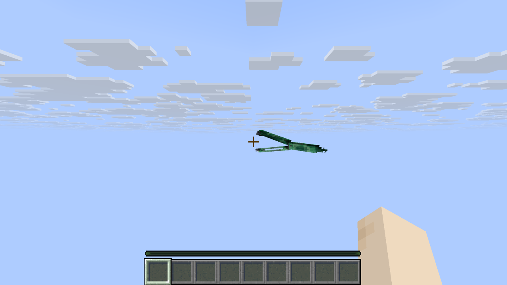

# MCCases

**Open cases. Collect skins. Trade together.**

A server-side Paper plugin with a virtual skin collection, public opening animations,
individual inspect motions and an economy built from Minecraft items. Inspired by
Counter-Strike 2, it works with an ordinary Minecraft client and no client mod.

**1.2.4** · **Paper 26.3, API build 159 beta** · **Java 25** · **22 cases · 815 skins · 63 models**

[Download plugin](https://github.com/Plattnericus/CS2CasesPlugin/raw/refs/heads/main/release/MCCases-1.2.4.jar) ·
[Download Fusion HD pack](https://github.com/Plattnericus/CS2CasesPlugin/raw/refs/heads/main/release/MCCases-ResourcePack-Fusion-HD-1.2.4.zip) ·
[Checksums](release/SHA256SUMS-1.2.4) · [Full reference](docs/REFERENCE.md)

> **NOT AN OFFICIAL MINECRAFT PRODUCT. NOT APPROVED BY OR ASSOCIATED WITH MOJANG OR MICROSOFT.**
> MCCases is also independent of Valve. Contact: **info@plattnericus.dev**.



[Quick start](#quick-start) · [Playing](#playing) · [Commands](#commands) ·
[Resource pack](#resource-pack) · [Configuration](#configuration) ·
[Updating](#updating) · [Legal information](#legal-information) · [Development](#development)

## Features

| Feature | Behavior |
| --- | --- |
| Catalog | 22 cases and 815 skins for 35 weapons, 20 knives and eight glove types |
| Openings | Up to nine public wheels at once; fixed size, glass backgrounds and a centered grid that fits the opener’s view; larger requests are queued |
| Collection | Private 3D gallery or chest menu, favorites, categories, search, filters and sorting |
| Inspects | 252 individual variants, articulated models, both hands and separate owner/observer views |
| Direct trading | Two offers, shared reservations and confirmation by both players; source reads “Knife traded (Case / TRADE IN)” |
| Marketplace | Emerald-item payments, search, sorting and durable proceeds for offline sellers |
| Trade-in | Ten compatible weapons for the next rarity; five Covert weapons for a gold item |
| Skin properties | Float, wear, pattern, StatTrak, source and creation date; Doppler, Fade and Blue Gem analysis |
| Dealer | Villager or mannequin, diamond payments, optional changing skins and gestures |
| Storage | SQLite by default; optional MySQL/MariaDB; journals and interrupted-operation recovery |
| Language | English for every client by default; 45 optional translation files |

Skins are cosmetic. Damage, durability and enchantments remain intact. Gloves are
collection/inspect objects; they do not replace worn armor.

## Quick start

1. Prepare a **Paper 26.3 server with Java 25**. Read and accept the Minecraft EULA yourself.
2. Copy [MCCases-1.2.4.jar](release/MCCases-1.2.4.jar) into `plugins/`. Install only one production MCCases JAR.
3. Start the server. Defaults appear in `plugins/MCCases/`.
4. As an operator, run `/csadmin info`, then `/csadmin shop spawn` to create a dealer.
5. Enable the matching [resource pack](release/MCCases-ResourcePack-Fusion-HD-1.2.4.zip) in the client and set `resource-pack.enabled: true`, or use automatic distribution below.

Give a connected player their first nine signed pairs:

```text
/csadmin givecase PlayerName kilowatt_case 9
/csadmin givekey PlayerName case_key 9
```

The player opens `/cases`, selects the case and chooses **Open 9 cases together**.
Alternatively, use `/cases open kilowatt_case 9`. Each opening consumes one signed
case and its matching key. All nine world animations run concurrently.

Each wheel keeps the same size from one to nine openings. The complete 3×3 grid,
including its glass frames, fits the opener’s view at the tested 70° field of view.
The layout centers incomplete rows and uses five visible skin icons per wheel.
`opening.world.scene-scale` sets an upper size limit; camera fitting may reduce it.

No additional plugins are required. Without the pack, collection browsing and
map/block previews still work; textured skin sprites require it.
The `MCCases-DevChecks` JAR belongs only on a test server.

The pinned **Paper API build 159 is a beta**. Other versions and configurations need
separate runtime testing.

## Playing

### Collection and equipment

`/inventory` or `/skins` opens your 3D gallery. `/inventory vanilla` opens a chest
menu. `/knife` shows your knives.

| Gallery input | Action |
| --- | --- |
| Look at a skin | Name and properties in the action bar |
| Right-click | Open the inspect menu |
| Left-click a knife | Equip or unequip it |
| Left-click a weapon | Equip or unequip the bow skin |
| Sneak + left-click a weapon | Equip or unequip the crossbow skin |
| Sneak + right-click | Toggle favorite |
| Scroll wheel / number keys | Select a hotbar slot without changing gallery pages |
| Page buttons | Browse the collection |
| Move ten blocks away | Close the gallery |

A skin occupies one of `knife`, `bow` or `crossbow`. Collections are virtual;
dropping a sword does not transfer its skin. Other known players can be viewed
when `mccases.view` is allowed.

### Inspect and perspective

- **F** or `/inspect`: inspect an equipped skin.
- **Sneak + F**: swap hands normally.
- **Sneak + right-click** a skinned weapon: start an inspect.
- `/inspect hand`: use the body-hand view, suitable for F5.
- `/inspect view`: use the first-person view.

Minecraft does not report F5 camera mode to Paper, so choose the view with a command.
Models animate display entities; they do not replace Minecraft's arms.
Karambit and Talon use reversed presentation and animate around their finger rings.



### Opening multiple cases

```text
/cases open kilowatt_case 100
/openings
/cases cancel
```

Requests accept **1–1000** cases. World mode shows up to nine simultaneous openings
in a centered grid, including held results; further requests wait. GUI mode presents
results sequentially. The server chooses each reward before its animation.
Repeated clicks cannot reserve the same pair twice.

`/cases cancel` releases waiting requests. Prepared rewards finish or are recovered.
On existing servers, check `opening.max-active-per-player: 9` and
`opening.display: world`. Rendering keeps a bounded moving window instead of spawning
every reel entry, caches icons and shares a single audible tick track across the nine reels.

### Trading, marketplace and trade-in

| System | Entry | Payment / confirmation |
| --- | --- | --- |
| Direct trading | `/trade PlayerName` | Both players confirm the same offer; edits reset confirmations |
| Marketplace | `/market` | Emerald items; sellers collect proceeds with `/market claims` |
| Trade-in | `/tradein` or `/tradeup` | Review and confirm separately; inputs are permanently consumed |

Trade-in inputs need compatible rarity, the same StatTrak status and a valid source
case. Sorting and key filters open direct choice lists, with the current choice marked.
Selections survive navigation; **Auto select skins** excludes favorites.
**Possible rewards** shows every eligible output and its chance before confirmation.
Each confirmed contract makes a fresh random draw, weighted by its input cases.
Repeated results are possible, and a pool with only one eligible skin always returns it.
Outputs show **Source: TRADE IN**. Directly traded knives additionally show
**Knife traded (original case)** or **Knife traded (TRADE IN)** without losing admin provenance.

Proceeds remain stored when inventory space is unavailable; nothing is dropped on
the ground. SQLite and Minecraft player files are separate storage systems. See
[recovery details](docs/UPGRADE-1.1.md) for the practical limits.

## Commands

| Player command | Purpose |
| --- | --- |
| `/inventory`, `/skins`, `/inventory vanilla` | View collections |
| `/knife [Player]` | View knives |
| `/cases`, `/cases open <Case> <Amount>` | Browse cases and start openings |
| `/openings`, `/cases cancel` | Queue and results |
| `/inspect [hand\|view]` | Inspect and select perspective |
| `/trade [Player]`, `/trade accept`, `/trade decline`, `/trade cancel` | Direct trading |
| `/market`, `/market own`, `/market sell <Skin-ID> <Price>` | Marketplace |
| `/market search <Name>`, `/market balance`, `/market claims`, `/market recover` | Search, balance, proceeds and recovery |
| `/tradein`, `/tradeup` | Trade-in contracts |

| Operator command | Purpose |
| --- | --- |
| `/csadmin info` | Check version and loaded catalog |
| `/csadmin givecase <Player> <Case> [Amount]` | Give cases |
| `/csadmin givekey <Player> <Key> [Amount]` | Give keys |
| `/csadmin giveskin <Player> <Skin> [Float] [Pattern] [StatTrak]` | Give a skin |
| `/csadmin manage <Player>` | Manage a collection, including known offline players |
| `/csadmin shop spawn [villager\|mannequin]` | Create a dealer |
| `/csadmin odds <Case>` | Show actual configured drop chances |
| `/csadmin exportpack` | Export the current server catalog's pack |
| `/csadmin reload` | Reload configuration and catalog |

`<Argument>` is required; `[Argument]` is optional. Do not type the brackets.
Invalid arguments and denied actions explain the reason in chat, including hidden
admin commands. Unexpected failures show a reference ID tied to the server log.
Admin skin/equipment changes confirm success after persistence. Instance IDs need at
least eight characters and must be unique; `/csadmin list <Player>` shows short IDs.
See the [complete command and permission reference](docs/REFERENCE.md#commands).

`mccases.use`, `mccases.inspect`, `mccases.view`, `mccases.shop`, `mccases.trade`,
`mccases.market` and `mccases.tradein` are allowed to players by default.
`mccases.admin` defaults to operators.

## Resource pack

The JAR and [Fusion HD ZIP](release/MCCases-ResourcePack-Fusion-HD-1.2.4.zip) are a matched pair.
The JAR embeds exactly this pack and extracts it to
`plugins/MCCases/resourcepack/MCCases-ResourcePack.zip`.
Every build uses the 815 skin sprites and 1,377 inspect layers from your original Fusion HD
1.2.0 archive, stored in `resourcepack/artwork/`. The supplied colours and patterns are retained;
exported coverage is made opaque and ring-knife presentation is turned to match its grip.
Held items use solid meshes with palm anchors for both hands, while menus use the original sprites.
Pack models use the supplied fixed artwork per finish. Float and pattern remain stored
properties; dynamic map previews use the configured renderer. New catalog IDs also use
that renderer. Your server fonts and pack icon from
`resourcepack/fusion/` retain their exact original bytes.
The same Fusion overlay is embedded in the JAR and reapplied by `/csadmin exportpack`.
An older or edited installed pack is refreshed while preserving its server artwork.

For automatic distribution, edit the existing `resource-pack` section:

```yaml
resource-pack:
  enabled: false
  namespace: mccases
  distribution:
    enabled: true
    bind-address: 0.0.0.0
    port: 8165
    public-url: "https://packs.example.net"
    required: false
    prompt: "<gray>MCCases skin textures"
```

The public URL must route through your configured proxy to the pack webserver.
The built-in server uses HTTP and does not provide an HTTPS certificate; alternatively,
use a reachable HTTP address with its port. Distribution also enables item models.

For a combined server pack, include the current Fusion ZIP's `assets/mccases/` and its two
`assets/minecraft/shaders/core/item.*` programs. Set
`resource-pack.enabled: true` and use your own distribution. Re-export after catalog
changes. The Fusion HD pack is the default download. Keep custom server artwork outside
`assets/mccases/`; that namespace and the two item shader programs are regenerated
from the current catalog as a unit.
See [Fusion sources and checks](resourcepack/fusion/README.md) before replacing assets.

### Vanilla metal finish

The matching pack includes a restrained, view-dependent metallic sheen on marked weapon
faces in **vanilla Minecraft 26.3**. Handles, gloves and ordinary vanilla items keep their
normal shading. No client mod or post-effect command is required. This approximates an
environment reflection; it does not reflect actual nearby blocks or provide screen-space
water/glass reflections. Skins and player interfaces remain readable.

The shader baseline follows Minecraft 26.3's item pipeline, including lightmaps, fog and
order-independent transparency. Use the matching pack rather than copying older core
shader files. Custom shader packs that replace the same programs need a manual merge.

## Configuration

| File / setting | Purpose |
| --- | --- |
| `config.yml` | Displays, openings, language, database and pack distribution |
| `shop.yml` | Dealer, case/key prices; default currency `DIAMOND` |
| `market.yml` | Emerald prices, proceeds, listings and trade limits |
| `inspect.yml`, `inspect-profiles.yml` | Models, joints, animations and camera positions |
| `catalog/` | Cases, skins, rarities, weights, keys and patterns |
| `messages_*.yml` | Optional translations |
| `language: en`, `client-language: false` | English for every player, regardless of client locale |
| `skin-inventory-item.enabled: false` | No permanent inventory shortcut |
| `opening.max-active-per-player: 9` | Up to nine prepared openings per player |
| `opening.world.scene-scale: 3.0` | Upper size limit; the whole nine-wheel grid stays camera-fitted |

Existing settings survive updates; missing defaults are merged. Set the English
language options above in an older configuration if it previously selected another
language. Database changes require a restart. See the
[configuration/custom-content reference](docs/REFERENCE.md#configuration).

Default tier weights are **79.923 / 15.985 / 3.197 / 0.639 / 0.256** for
Mil-Spec / Restricted / Classified / Covert / Gold. Eligible items have **10%** StatTrak
chance. Actual loaded weights and pools determine the result; `/csadmin odds <Case>`
shows those chances.

## Updating

1. Stop the server cleanly.
2. Back up `plugins/MCCases/`, the database, world/player data, journals and `secret.key` together.
3. Replace the production JAR and update the matching resource pack.
4. Start the server, check `/csadmin info` and compare existing settings.

**1.2.4** fits all nine glass wheels into the opener’s view while keeping every wheel
at a constant size. Case batches default to nine, with a direct quantity selector.
Sorting and key filters use explicit choice menus, and trade-ups show exact reward
odds using the same random draw as confirmation. The original artwork and Vanilla
held-item models from 1.2.3 remain unchanged. Existing limits and custom settings
remain in place; set `opening.max-active-per-player: 9` and `visible-items: 5` to use
the default layout. New language keys merge automatically. Back up and replace
an unchanged `messages_en.yml` with the bundled default to refresh older button
wording; edited translations remain yours. The database remains at schema 4.
Replace JAR and pack together and compare [checksums](release/SHA256SUMS-1.2.4).

## Legal information

The stated server operation in **Italy** uses exclusively free in-game currency:
no money purchases for cases, keys, opening currency or skins; no cash-out, external
sales or material prizes. Other plugins and shops must not introduce indirect purchases.
These operating rules do not constitute legal approval.

- [Legal information and outstanding operator details](LEGAL.md).
- [Italian privacy template—complete it before use](docs/PRIVACY-IT.md).
- [Dependency, trademark and asset notices](THIRD_PARTY_NOTICES.md).

Notices are included in the JAR, pack and first-start data folder. The repository
has **no general open-source license**; public source alone does not grant unrestricted
reuse. Rights requests and project contact: **info@plattnericus.dev**.

## Development

For a dev server and client that remain available after the desktop app closes, use
`python3 scripts/dev.py start --persistent` after preparing the session. The supervisor
restarts either process if it exits, starts again at login and preserves the local dev world.
Use `python3 scripts/dev.py stop` to end the session.


Use JDK 25 and the included Gradle wrapper:

```sh
bash gradlew build
```

This creates `build/libs/MCCases-1.2.4.jar` and
`build/distributions/MCCases-ResourcePack-Fusion-HD-1.2.4.zip`, running `verifyFeatures` and
`verifyPack` plus `verifyFusionPack`. Copy verified artifacts to `release/` and update
their checksums.

The [1.2.4 verification report](docs/RELEASE-1.2.4-VERIFICATION.md) documents
random contracts, direct choice menus, fitted wheels and actual client rendering.
[1.2.3 artwork and animation evidence](docs/RELEASE-1.2.3-VERIFICATION.md) records
all held models and animations retained byte-for-byte in this release.
The [1.2.1 report](docs/RELEASE-1.2.1-VERIFICATION.md) records the earlier 154 command
checks, ten live suites and inspect/wheel captures. The
[earlier 1.2.0 command report](docs/COMMAND-VERIFICATION-2026-10-10.md) records 135 checks.
Older [hotbar/HD-pack](docs/HOTBAR-HD-VERIFICATION.md) and
[multiple-opening/trade-in](docs/MULTI-OPENING-VERIFICATION.md) evidence is dated separately.

[Development guide](docs/DEVELOPMENT.md) · [Full reference](docs/REFERENCE.md) ·
[Issues](https://github.com/Plattnericus/CS2CasesPlugin/issues) · [Project website](https://plattnericus.dev)

MySQL/MariaDB, large player counts, other plugins and different client/server versions
need their own runtime testing. Terrain and camera settings can obscure world displays.
Report reproducible issues with version, configuration and a sanitized log; do not
publish databases, passwords or `secret.key`.
