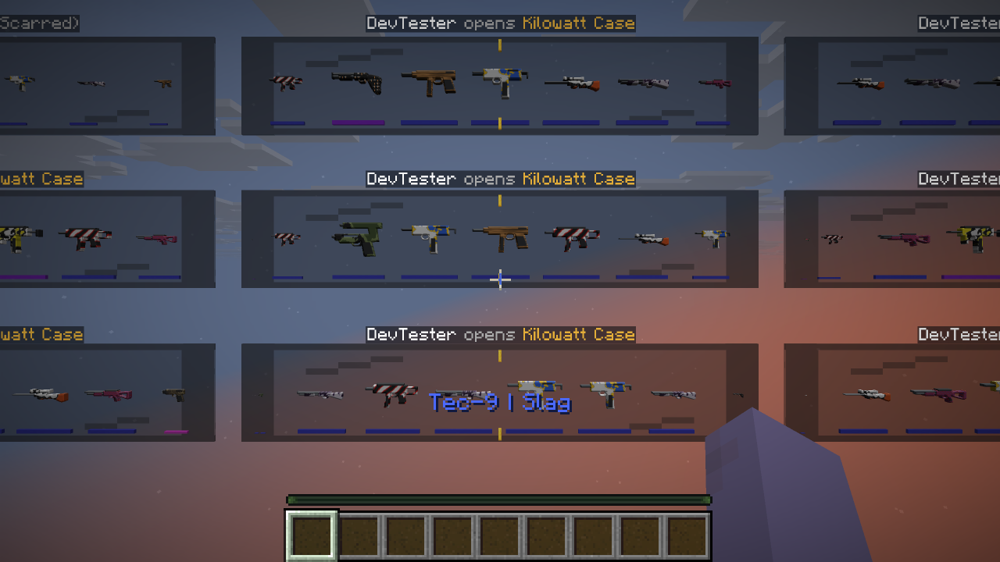
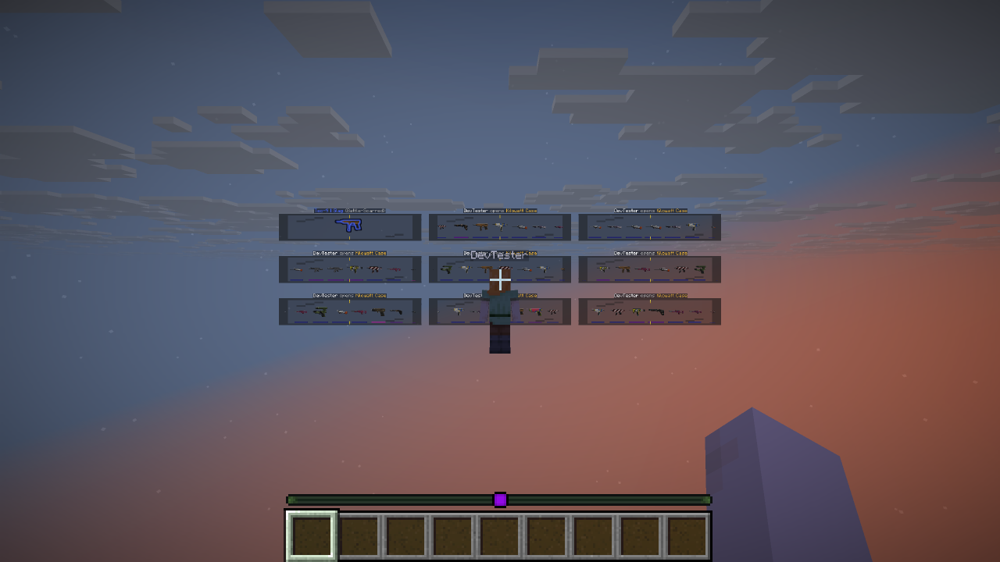
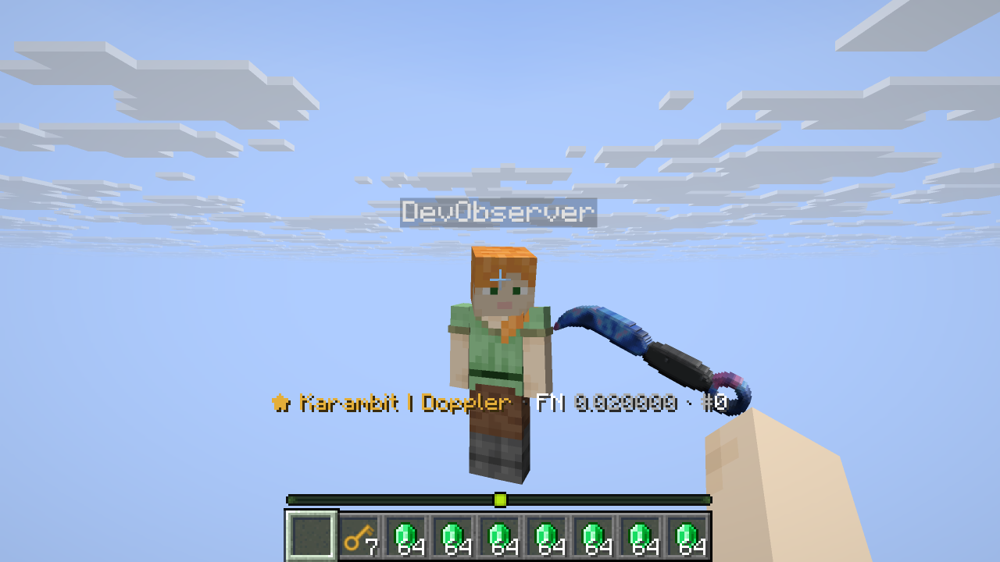
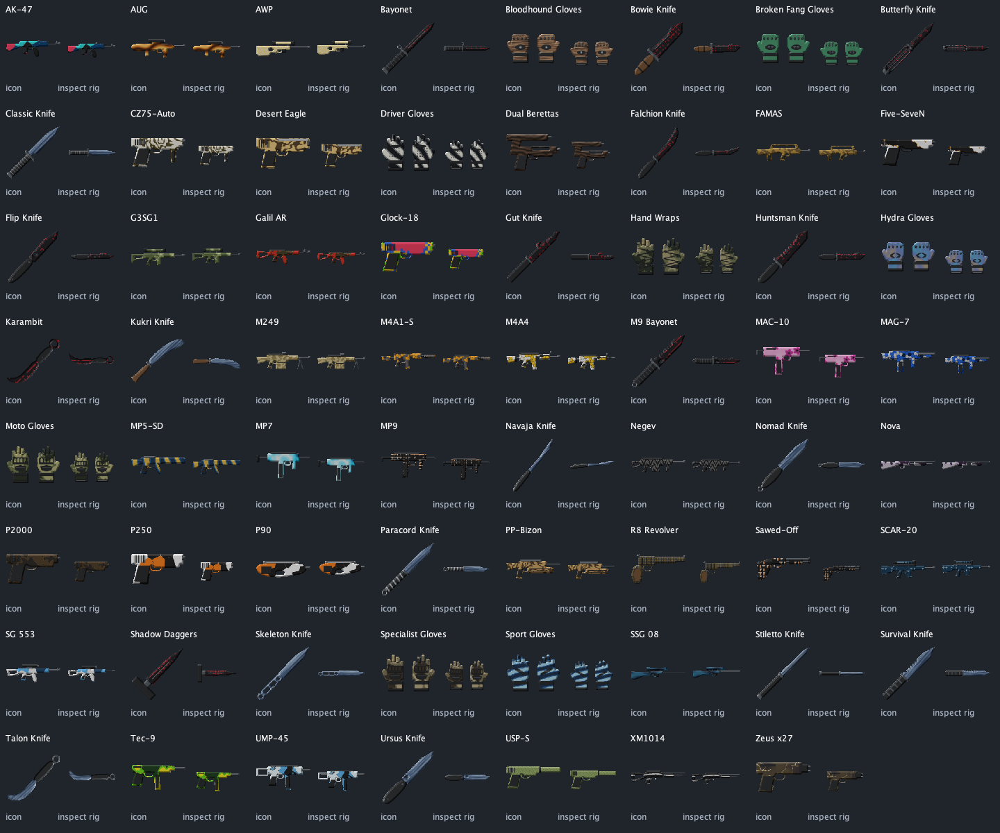

# MCCases 1.2.1 — build and verification, October 10, 2026

A new versioned production JAR and matching standard pack. Source base: `185b05d`
plus this release's changes. Earlier 1.2.0 artifacts and reports remain historical.

## Changes

- Skin sprites and inspect layers use 128px instead of 64px. Fractional area sampling
  uses premultiplied alpha; transparent pixels do not create dark fringes. Binary
  silhouette coverage prevents Minecraft from extruding faint edge pixels. Knife
  rotation uses an expanded canvas before cropping.
- Karambit and Talon turn 180° in sprites, inspect rigs and block fallback. Finish
  sampling, seed distribution and saved pattern classifications keep their original
  coordinates. All eight ring profiles rotate around the finger ring, move toward
  the camera's center and return to their held pose. Reverse catches contain a real
  half-turn; Talon loop/spin use a controlled full turn. Unchanged stock timelines
  upgrade automatically; custom timelines remain intact.
- Directly traded knives show **Knife traded (Chroma Case)** or
  **Knife traded (TRADE IN)** in normal and precise lore. Other skins use
  **Traded (source)**. Repeated trades do not nest the label. Source, admin provenance,
  identity, float, pattern and StatTrak survive. Market purchases preserve earlier
  direct-trade history without introducing the flag themselves.
- Schema 4 stores `traded` independently of `origin` and `source`. Recorded earlier
  direct trades are backfilled using skin instance IDs, never player IDs. DDL/backfill
  can be retried; failed trades roll back the mark as well as ownership.
- Permission denial produces a localized reply even when Brigadier hides a command
  root. Coverage includes all 14 player labels and admin labels, namespace and casing.
  Authorized input and unrelated command roots are left to their registered handlers.
- World wheels use **BLACK_STAINED_GLASS** again. `opening.world.scene-scale: 3.0`
  scales the entire scene and grid spacing by exactly **3×** relative to the previous
  layout at the same distance/count: glass, icons, markers, title, rewards and click
  targets. Enlargement is applied after layout fitting, so reflow does not cancel it.
  The larger grid can extend beyond the opener's camera; step back for a full overview.
  Set `1.0` for the compact view. Invalid/nonfinite values warn in English and use `3.0`.
- Nine independent openings remain concurrent. Larger quantities queue, the moving
  display window stays bounded, icons are cached and the reels share one tick track.
  Scaling adds no extra display entities or texture layers.
- English remains the fixed default: `language: en`, `client-language: false`.
  README, current reference, download page, legal information and this report are
  English. Optional translations and the Italian privacy template remain available.

## Build and functional checks

Temurin **25.0.2**, Gradle Wrapper **9.4.1**, Paper API **26.3.build.159-beta**:

```sh
JAVA_HOME=<JDK-25> bash gradlew build devChecks inspectRigPreview --console=plain
# Final build after the permission/scale changes and English documentation:
JAVA_HOME=<JDK-25> bash gradlew build devChecks --console=plain
```

**BUILD SUCCESSFUL**. The [build log](RELEASE-1.2.1-BUILD.log) records actual results
and existing Java/JOML/Gradle warnings. JUnit is `NO-SOURCE`; functional checks run
through `verifyFeatures` and `verifyPack`.

| Check | Successful coverage |
| --- | --- |
| Catalog | 815 skins, 22 cases, 5,500 reward/reel checks |
| Inspect | 63 rigs, 252 variants, 880,360 joint frames; both hands, eye/hand mode, 70° FOV at 4:3; fixed ring pivots and correct return pose |
| Pack | 815 sprites, 1,377 inspect layers, 204,600 opaque rim faces; UVs, 128px, transparent edges, both hands and reverse-grip direction |
| Provenance | CASE, TRADE_IN, ADMIN, ADMIN_TRADE_IN; en/de/it lore, repeat trades, listing/cancel, old/new journals, actual v3 migration and repeat restarts |
| Storage / commerce | Real SQLite, concurrent buyers, reservations, identity, partial payments, failure injection and rollback |
| Openings / trade-in | Grids 1–9, exact 3× geometry and non-overlap at three distances, queues/recovery, normal/gold contracts, filters and favorite protection |
| Text | 45 valid language schemas, regional fallback and English defaults |

The [profile generator](../scripts/generate_inspect_profiles.py) was compared with
all 252 saved timelines: semantically identical output. Python capture/profile
scripts pass syntax compilation.

## Actual Paper/client run

The production JAR ran on an isolated, previously accepted Paper 26.3 server with
SQLite and two Vanilla 26.3 clients using the new standard pack. Existing stock
profiles and the old bundled ZIP upgraded to the new content; storage is schema 4.
The final run uses the enlarged wheel configuration merged into an existing config.

- **154 command checks** and **ten live suites** pass. Real production handlers and
  database transactions are exercised; controlled audience/parser proxies also
  provide invalid input, permission denial and injected SQL failures.
- Vanilla clients additionally send actual network commands for balance, claims,
  trade request/accept/cancel and invalid input. Five admin spellings, including
  namespace and uppercase, show visible permission errors without operator rights.
- Two players complete a real direct trade. A case knife and an admin trade-in knife
  show the new source text while retaining their original provenance.
- The nine-case run checks nine simultaneous views, correctly scaled glass at each
  reel anchor, bounded item-display counts (153 at the sampled peak), missing-key rejection, duplicate requests,
  reservations, exact consumption, durable rewards and complete entity/receipt cleanup.
  The settings loader also checks missing, nonfinite and out-of-range scene scales.
- **104 actual frozen client frames** cover all eight Karambit/Talon variants at ticks
  8/22/40, owner/observer, extra angles, left hand and both F5 cameras.
- **Eight complete live animations**, with eight owner/observer pairs each
  (**128 frames**), end naturally and remove their display entities.
- **16 ordinary held-item captures** cover both knives/hands and first/third-person
  views. **18 enlarged-wheel captures** cover grid sizes 1–9 from the opener and
  an observer standing farther back for a complete overview.

[Live results](verification/1.2.1/live-results.json),
[client command replies](verification/1.2.1/client-command-results.json),
[permission checks](verification/1.2.1/permission-results.json),
[inspect metadata](verification/1.2.1/inspect-captures.json) and
[motion metadata](verification/1.2.1/motion.json) and
[wheel metadata](verification/1.2.1/wheel-captures.json) record the runs.
The [runtime log](RELEASE-1.2.1-LIVE.log) contains the PASS messages. Raw captures and
63 software previews are in the [visual archive](../release/MCCases-Visual-Checks-1.2.1.zip).
Software renders are explicitly separate from actual Minecraft captures. Inspect/
held captures use assets verified byte-for-byte against the final pack; wheel captures
were repeated after enlargement.









## Artifacts and practical limits

The JAR contains **247 production classes**, identical to compiler output, version
**1.2.1**, legal documents and exactly the separately distributed pack ZIP. Both ZIPs
pass CRC checks. No check classes, shaded dependencies or vanilla overrides are
included. Original PNG layers remain intact; sprites/rigs come from the corrected
export. [Artifact verification](verification/1.2.1/artifacts.json) and
[SHA-256 checksums](../release/SHA256SUMS-1.2.1) record the delivered files.

Coverage applies to the stated Paper/client/SQLite configuration. MySQL/MariaDB,
other clients, custom timelines/scales and combined packs were not live-tested.
Compare custom ring timelines with the new pivots. Both live clients use `en_US`;
other locales were checked through language-schema/formatter tests. English legal
information preserves the existing operating conditions and outstanding operator/
asset fields; it grants no new license or legal clearance. The separate Fusion-HD
pack is not part of this standard release.
