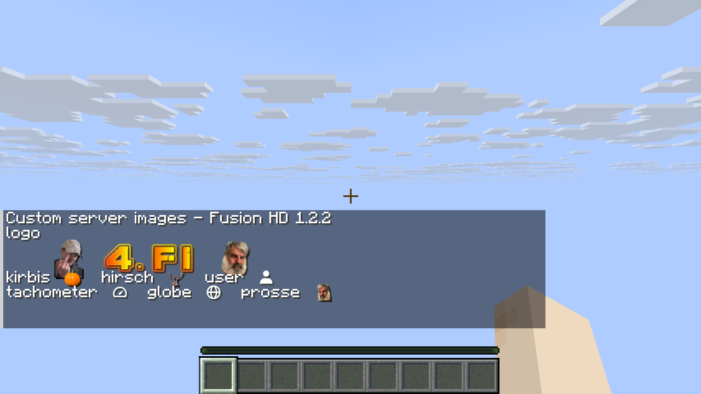
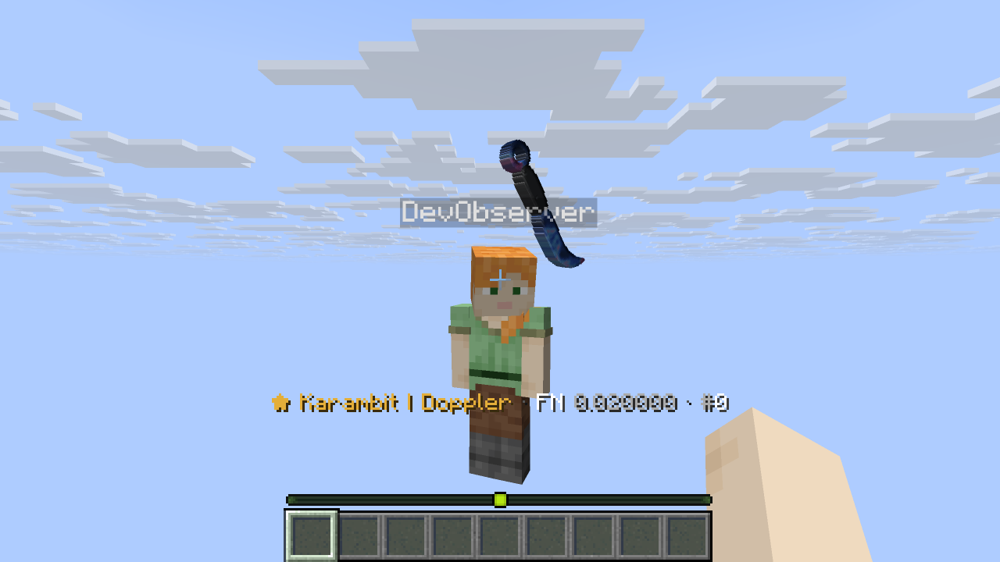
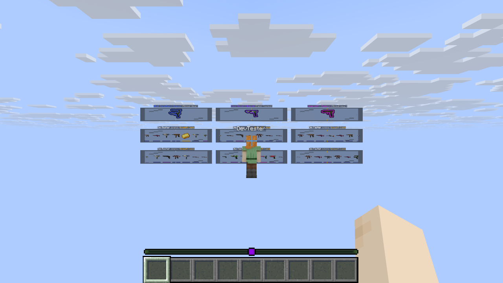

# MCCases 1.2.2 — permanent Fusion HD, October 10, 2026

Every normal build now produces the Fusion pack and embeds that exact ZIP in the
production JAR. The custom server images supplied in
`MCCases-ResourcePack-Fusion-HD-1.2.0.zip` are stored permanently in
[resourcepack/fusion](../resourcepack/fusion/README.md). Future builds require no
Downloads file, manual merge or Python image processing.

## Custom assets and clean skin edges

Seven original font images, their provider JSON and the pack icon remain
**byte-for-byte identical** to the supplied ZIP. These nine files have SHA-256
provenance in [SOURCE.json](../resourcepack/fusion/SOURCE.json).
The source ZIP itself was not modified. The [preservation check](verification/1.2.2/source-preservation.json)
compares the original ZIP, tracked source, final Fusion ZIP and actual server export.

The old generated MCCases namespace is replaced as a unit by the current exporter:
**9,090 managed assets** match both the current generator and the verified 1.2.1
skin/model assets. This retains the 128px edge fixes, compatible front/back UVs,
reverse-grip Karambit/Talon orientation and inspect pivots. It avoids pairing old
textures with current geometry. The supplied custom artwork receives no cropping,
resampling, recoloring or alpha changes.

`/csadmin exportpack` applies the same Fusion recipe to the actual server catalog
and retains additional installed server artwork. Incomplete skin exports and
missing/invalid bitmap-font assets fail before replacing the previous working ZIP.
Installation receipts prevent an unchanged restart from overwriting an exported
custom catalog with the stock catalog.

## Build and automated checks

Temurin **25.0.2**, Gradle Wrapper **9.4.1**, Paper API **26.3.build.159-beta**:

```sh
JAVA_HOME=<JDK-25> bash gradlew build devChecks --console=plain
```

**BUILD SUCCESSFUL**. The [build log](RELEASE-1.2.2-BUILD.log) includes the actual
results and existing Java/JOML/Gradle warnings. JUnit is `NO-SOURCE`; the checks run
through `verifyFeatures`, `verifyPack` and `verifyFusionPack`.

| Check | Passed coverage |
| --- | --- |
| Fusion | 9,090 current managed assets, ten exact overlay files including provenance, 6,060 resolved model/texture references and seven valid bitmap providers |
| Merge/install | Deterministic repeat output, first/edited installation, malformed receipt recovery, unchanged restart, exported custom catalog retention and obsolete managed-model removal |
| Failure handling | Missing font texture gives a useful error and retains the working output; overwriting an input ZIP is rejected |
| Skin edges | All 815 sprites and 1,377 inspect layers are 128px; binary silhouette alpha, no hidden color fringe or canvas clipping; 204,600 opaque rim faces and correct front/back UVs |
| Inspect | 63 rigs, 252 variants and 880,360 finite joint frames; both hands and first/third-person poses |
| Catalog/text | 815 skins, 22 cases, 5,500 reward/reel checks and 45 valid language schemas |
| Storage/commerce | SQLite transactions, concurrent buyers, reservations, identity, migration, failure injection, rollback and recovery |
| Openings/trade-in | Nine concurrent openings, exact 3× glass geometry, independent lanes, durable outcomes, filters and favorite protection |
| Development launcher | Three Python unit tests; launcher and compatibility merger pass syntax compilation |

## Actual Paper and Minecraft run

The final production JAR ran on the isolated Paper 26.3/SQLite fixture with two
Vanilla 26.3 clients loading the final **Fusion** ZIP. Both clients use `en_US`;
the plugin uses its English default. All **155 command checks** and **ten live
suites** pass again, including a real `/csadmin exportpack` whose custom assets
match the embedded overlay. [Live results](verification/1.2.2/live-results.json)
and the [runtime log](RELEASE-1.2.2-LIVE.log) record the outcomes.

The nine-case suite verifies nine simultaneous 3× glass wheels, nine durable SQL
rewards, exact signed-pair consumption, duplicate/insufficient-key rejection,
reservations and complete cleanup. Its sampled peak is **153 item displays**.
Queue controls and repeated-click handling pass separately.

Current-pack visual evidence includes **104 frozen Karambit/Talon client frames**
covering all eight variants, owner/observer, extra angles, left hand and F5 views;
**16 ordinary held-item frames**; and **18 enlarged-wheel frames** for grid sizes
1–9. Residual test NPCs were removed before the inspect/held captures were repeated
with unobstructed cameras. These are actual Minecraft framebuffer captures.

The custom glyphs `U+E002` through `U+E008` render in the real client alongside
ordinary English text. [Font metadata](verification/1.2.2/font-captures.json),
[inspect metadata](verification/1.2.2/inspect-captures.json),
[held metadata](verification/1.2.2/held-captures.json) and
[wheel metadata](verification/1.2.2/wheel-captures.json) identify the captures.
The exported server pack also survives an actual stop/start unchanged:
[restart check](verification/1.2.2/restart.json).








## Delivered artifacts and scope

[Plugin](../release/MCCases-1.2.2.jar),
[Fusion pack](../release/MCCases-ResourcePack-Fusion-HD-1.2.2.zip),
[visual evidence](../release/MCCases-Visual-Checks-1.2.2.zip) and
[SHA-256 checksums](../release/SHA256SUMS-1.2.2) are versioned together.
[Artifact checks](verification/1.2.2/artifacts.json) compare the embedded pack and
overlay with the build outputs, compiler classes, version, legal documents and ZIP
CRCs. All **248 production classes** match the compiler output. The production JAR
contains no integration-check plugin. Both client logs contain no font, texture or
model loading warnings/errors during the current-pack run.

Coverage applies to the stated Paper/client/SQLite configuration. MySQL/MariaDB,
different clients, other server packs, custom namespaces/timelines and large player
counts need separate runtime testing. The original artwork's pixel detail and font
sizes are preserved. The [1.2.1 report](RELEASE-1.2.1-VERIFICATION.md) remains
historical evidence for the unchanged skin geometry and full animation playback.
Asset provenance records the supplied files; it grants no new license or independent
rights clearance. Operator details in the privacy template still need completion.
