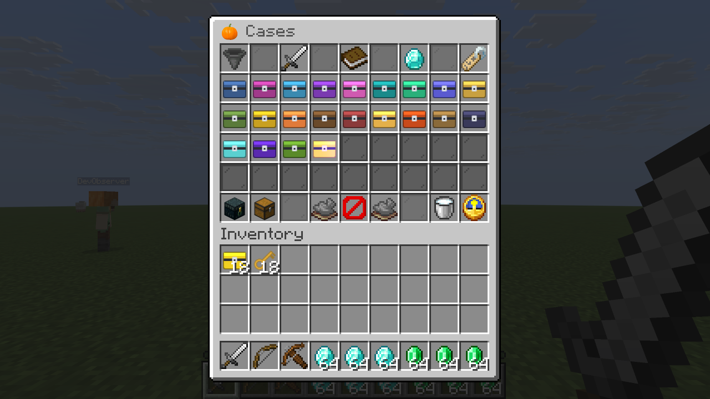
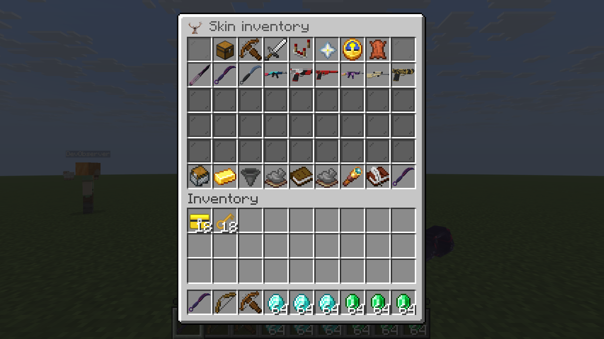
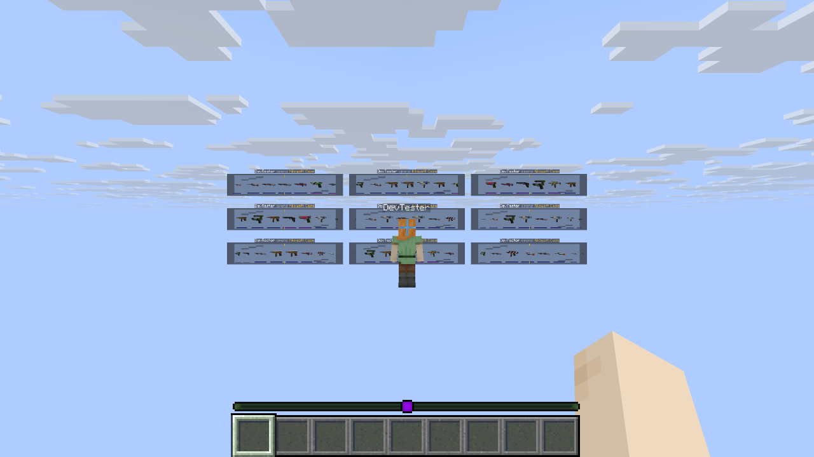
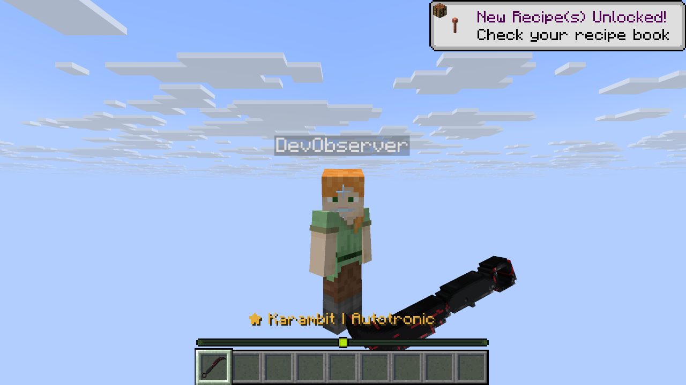
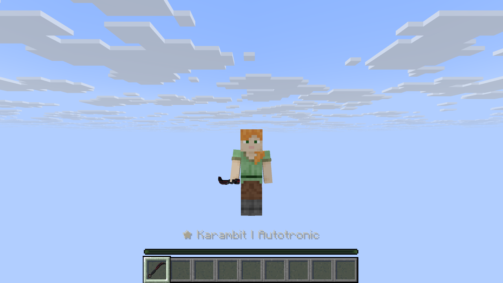
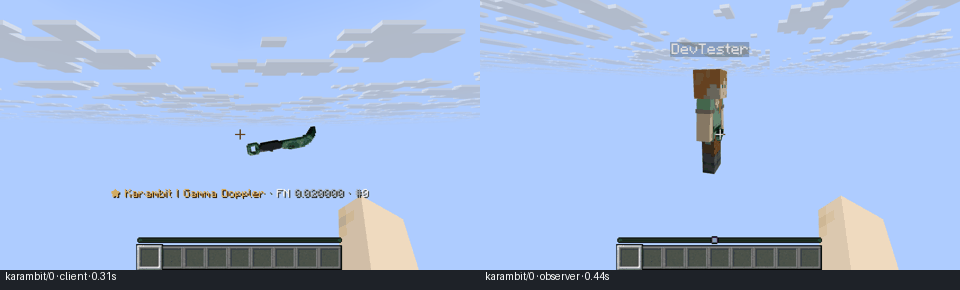
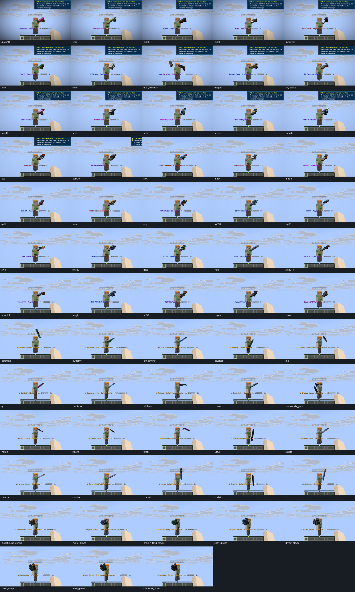

# MCCases 1.2.3 — original artwork and Vanilla presentation

Verified on October 10, 2026 with Temurin 25.0.2, Gradle 9.4.1, Paper
26.3 build 159 beta, SQLite and two ordinary Minecraft Java 26.3 clients.
The plugin, embedded pack and published Fusion ZIP form one matched release.

## Original textures and solid models

The supplied Fusion HD 1.2.0 archive remains unchanged. Its SHA-256 is
`2081bf6540d20178427ea175300ce978015d7c0fbda3dd0cac95944eb1efeae8`.
The project now stores all **815 inventory sprites and 1,377 inspect layers** in
[the permanent artwork source](../resourcepack/artwork/README.md), with hashes for
all 2,192 original PNGs. Future builds and server exports use these files without
depending on Downloads. The seven custom font images, font definition and pack
icon remain byte-for-byte identical to the supplied ZIP.

Exported masks have opaque silhouette coverage. Current cuboid geometry follows
the original pixels, with closed edges and corrected front/back UVs. Karambit and
Talon presentation and finger-ring pivots match this source artwork. Ordinary held
items use the inspect meshes, a palm anchor and mirrored left-hand geometry;
inventory icons retain the original sprites. The pack contains fixed artwork per
finish. Stored float and pattern properties do not generate per-instance pack UVs.

Minecraft 26.3's native item shaders add restrained view-dependent sheen to marked
metal faces. The pack preserves the native lighting, fog, glint and transparency
pipeline. No client mod is used. **This simulates environment reflection; it does
not reflect nearby world geometry or add screen-space water/glass reflections.**
Other packs overriding the same two item programs require a manual merge.

## Build and automated verification

```sh
JAVA_HOME=<JDK-25> bash gradlew build devChecks --console=plain
python3 -m unittest discover -s scripts -p 'test_*.py'
```

The [build log](RELEASE-1.2.3-BUILD.log) records **BUILD SUCCESSFUL**. Five launcher
tests and Python syntax compilation pass. JUnit is `NO-SOURCE`; the meaningful Java
checks run through the Gradle feature, pack and Fusion verification tasks.

| Check | Passed coverage |
| --- | --- |
| Source preservation | 2,192 original skin PNGs and nine unchanged custom font/icon files |
| Export | 815 sprites, 1,377 inspect layers, 101,310 opaque rim faces, source colours, front/back UVs and native palm transforms in both hands |
| Fusion | 9,090 MCCases assets, two current item shader programs, ten exact overlay files and 7,437 resolved references |
| Install/export | Deterministic output, receipts, repeated restart, custom catalog retention, obsolete shader replacement and atomic failure recovery |
| Inspection | 63 rigs, 252 timelines and 880,360 finite joint frames; both hands, eye/hand anchors, 70° 4:3 camera bounds and cyclic-rig rejection |
| Animation scheduling | Immutable shared schedules, stationary segment reduction, inherited motion and full-turn refinement |
| Catalog/text | 815 skins, 22 cases, 5,500 reward/reel checks and 45 language schemas |
| Storage/commerce | SQLite transactions, reservations, migration, concurrent buyers, rollback, recovery and provenance after repeated trades |
| Openings | Nine simultaneous durable outcomes, independent lanes, exact 3× glass geometry and interrupted-opening recovery |

The original source archive, final JAR, Fusion ZIP and actual `/csadmin exportpack`
were compared independently. **All 9,100 asset files** in the runtime export match
the release pack. All **249 production classes** match the compiler output. The
embedded pack and original-artwork archive match their build inputs exactly; ZIP
CRC checks pass and the production JAR includes no integration-check classes.
[Artifact evidence](verification/1.2.3/artifacts.json) records the hashes and sizes.

## Live commands, menus and opening behavior

The production plugin passes **155 live command checks and ten live suites** on
actual Paper. These exercise roots and aliases, handlers, invalid input,
permissions, console use, useful error references, SQL rollback, collection and
equipment controls, protected menus, two-player trade, purchases, trade-in,
case-guide filters, queue cancellation and repeated-click handling.
[Results](verification/1.2.3/live-results.json) and the
[live log](RELEASE-1.2.3-LIVE.log) identify each suite.

Nine actual simultaneous openings consume exactly nine signed pairs, save nine
distinct rewards and clean up all receipts and entities. The sampled peak is
**153 item displays**. The complete wheel, including black glass, uses 3× scale.
The enlarged nine-wheel grid extends beyond the opener's view; the observer capture
shows the full arrangement. Menus use the original pumpkin, deer and prosse glyphs
with dark readable titles and a quieter glass frame. English remains the default.







## Native visual and motion checks

Actual client framebuffer captures cover:

- **504 final held-item images:** all 63 types, both hands, Ego, front observer,
  F5 back and F5 front views at a 70° field of view.
- **210 inspect images** across all 63 types, with extra angles for knives/gloves.
- **104 focused Karambit/Talon frames**, covering all four variants, both hands
  and the F5 body anchor.
- **75 natural animation playbacks:** one for every type plus all four Karambit,
  Talon and Butterfly variants. All complete naturally and remove their displays.
  The capture scripts retain 1,200 sampled raw frames, 75 GIFs and 75 filmstrips.
- **18 wheel images**, owner and overview captures for every grid size 1–9.

These are Minecraft captures, not software render previews. The visual ZIP contains
the complete final held, inspect and wheel sets. The animation ZIP contains the
focused ring frames, GIFs and filmstrips; full raw motion frames remain under
`build/verification/`. Manifests record the model, view, variant and natural cleanup.
Some captures include Minecraft's normal offline-server chat or recipe toasts.
Client logs show no custom shader compilation or texture/model loading errors.









## Persistent local session and delivery

`python3 scripts/dev.py start --persistent` runs the dev server and client
independently of the desktop app, restarts exited processes and installs a login
starter. The actual client restart, server restart, reconnection and preservation
of the dev world are recorded in
[persistent-session evidence](verification/1.2.3/persistent-restart.json).
`stop` preserves persistent data and removes the login starter. The final local
session remains available at `127.0.0.1:25565` with the production build and pack.
For a body-anchored inspect in F5 use `/inspect hand`; use `/inspect view` for Ego.
The server cannot detect the client's F5 camera setting automatically.

[Plugin](../release/MCCases-1.2.3.jar),
[Fusion pack](../release/MCCases-ResourcePack-Fusion-HD-1.2.3.zip),
[visual checks](../release/MCCases-Visual-Checks-1.2.3.zip),
[animation checks](../release/MCCases-Animation-Checks-1.2.3.zip) and
[checksums](../release/SHA256SUMS-1.2.3) are versioned together. A matching Fusion ZIP
is also copied to Downloads without replacing the supplied 1.2.0 archive.

Coverage applies to this Paper/client/SQLite configuration. MySQL/MariaDB, custom
catalogs/timelines, other server packs and large player counts need separate runtime
testing. This preserves supplied artwork and improves its Minecraft presentation;
it does not establish a pixel-identical CS2 implementation. Asset provenance grants
no additional redistribution rights. The Italian privacy template still requires
the operator's legal identity, hosting details and retention policy.
