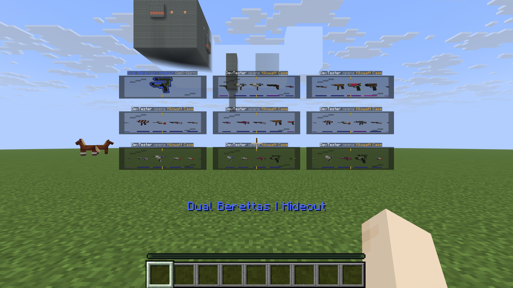
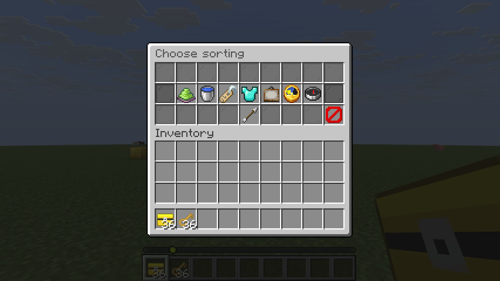
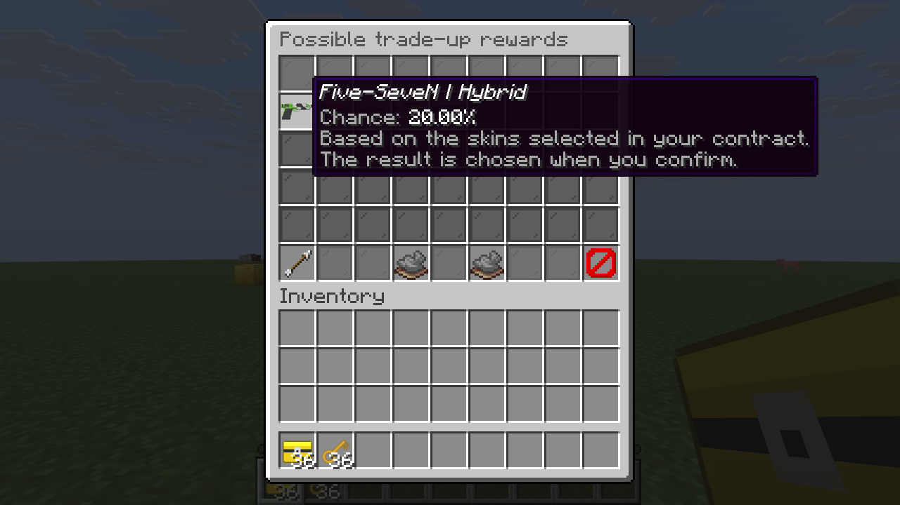

# MCCases 1.2.4 — fitted wheels, direct choices and random trade-ups

Verified on October 10, 2026 with Temurin 25.0.2, Gradle 9.4.1, Paper 26.3
build 159 beta, SQLite and two Vanilla Minecraft Java 26.3 clients.

## Opening layout

Every wheel uses the same world scale for counts **1–9**, including glass, labels,
markers, items and interaction boxes. The complete nine-wheel grid fits the opener’s
view at the tested **70° field of view**; offline geometry checks also cover **4:3**,
centering, incomplete rows, non-overlap and distances 1.2, 3 and 6 blocks.
`scene-scale` is an upper limit, with camera fitting taking priority. The default
moving window contains five skins instead of seven. Existing custom settings remain
in place; use `max-active-per-player: 9` and `visible-items: 5` for this default view.

The native capture set contains **18 images**, owner and observer for all nine grid
sizes. Client transform dumps confirm exactly 1–9 complete glass panels, each with
an unchanged width of **1.4547155 blocks** in this scene. No stepping back is needed.
[Capture metadata](verification/1.2.4/wheels/manifest.json) records these measurements.



The actual batch button admits nine sessions, consumes nine signed pairs, stores
nine distinct rewards and clears receipts and entities. The sampled peak is
**135 item displays**, compared with 153 in 1.2.3. The quantity selector also starts
100 cases: nine prepared and 91 waiting. Cancellation releases the 91 reservations;
teleport finalizes the nine prepared rewards without consuming the waiting pairs.

## Menus and trade-up rewards

Inventory, gallery, cases, market, sale selection and trade-up sorting use explicit
choice lists with recognizable Vanilla symbols and a marked current selection.
Important category, knife, rarity and StatTrak filters also use direct lists.
The case launcher has one single-case button and one batch button, defaulting to
nine; the duplicate queue launch button is removed. Original pumpkin, deer and
prosse branding remains in the pack.

Trade-ups use a fresh independent server random draw. The selected input determines
its source case, and the result is uniform within that case’s eligible next-tier
pool. Mixed cases are weighted by input count; direct administrator grants infer
only cases containing that exact skin. StatTrak compatibility and source provenance
remain enforced. **Repeats are valid random results; a one-skin pool has a 100% result.**

**Possible rewards** shows each eligible skin and its probability before confirmation,
using the same rule as the actual draw. Previewing does not consume inputs or advance
the random generator. Back navigation preserves selection; closing a submenu frees
reservations. Partner cancellation also closes a trade’s open choice menu.





## Verification

```sh
JAVA_HOME=<JDK-25> bash gradlew build devChecks --console=plain
python3 -m unittest discover -s scripts -p 'test_*.py'
python3 scripts/verify_release_live.py --root .dev/runtime --output build/verification/live
```

The [build log](RELEASE-1.2.4-BUILD.log) records **BUILD SUCCESSFUL**. Feature, pack
and Fusion checks pass; all five launcher tests pass. JUnit has no sources; the
meaningful Java checks run through the Gradle verification tasks.

- **12,000 deterministic test draws** cover all eligible outcomes for normal and
  StatTrak mixed-case contracts. Exact probabilities total 100% and observed
  frequencies agree with their 70/30 case weighting.
- **32 real contracts** each consume ten inputs through the actual selection and
  confirmation menus. Both eligible output skins occur: AK-47 Inheritance and
  AWP Chrome Cannon. Every result passes source/tier checks and SQL consumption.
- **155 command checks and twelve live suites** cover roots and aliases, error
  feedback, permission/console rejection, injected SQL rollback, equipment,
  two-player commerce, gold/normal trade-ups, filters, direct choice navigation,
  queue controls, nine simultaneous openings and duplicate-click rejection.
- A final menu icon pass repeats affected choice/trade-up/commerce suites and native
  menu captures. Test clicks respect the production one-click-per-tick guard.
- **30 native images** cover the nine grid sizes and twelve menu/choice views;
  transform dumps independently confirm constant panel size.

[Live results](verification/1.2.4/live-results.json),
[final GUI results](verification/1.2.4/final-gui-results.json) and
[the live log](RELEASE-1.2.4-LIVE.log) retain the evidence. Captures come directly
from the Vanilla client framebuffer, using a development-only harness excluded
from the production JAR.

## Pack and artifacts

All **9,100 asset files** remain byte-for-byte identical to the fully inspected
1.2.3 pack. This preserves all 2,192 original weapon/knife PNGs, nine custom font/icon
files, closed edge geometry, palm transforms and Vanilla metal sheen. The original
1.2.0 ZIP remains unchanged with SHA-256
`2081bf6540d20178427ea175300ce978015d7c0fbda3dd0cac95944eb1efeae8`.
Future exports still merge the permanently stored Fusion source.

The [1.2.3 visual report](RELEASE-1.2.3-VERIFICATION.md) retains its complete held-item,
inspect and animation evidence. These assets were not edited in this release.
Vanilla sheen simulates environment reflection; it does not reflect nearby geometry.

All **253 production classes** match compiler output. JAR/ZIP CRC checks pass,
embedded pack/source archives match build inputs, and the production JAR contains
no integration-check classes. [Artifact evidence](verification/1.2.4/artifacts.json)
records final sizes and SHA-256 values. The runtime export matches every pack asset.
The matching final Fusion ZIP is copied to Downloads and the persistent dev server
and one client remain available for manual testing.

The Visual Checks ZIP includes current captures, transform dumps, metadata and
reports. [Release checksums](../release/SHA256SUMS-1.2.4) identify the matched artifacts.
The legal/operator templates and rights notices are retained; release verification
is not legal approval. Different camera settings, terrain, other plugins, large
player counts and other client/server versions need their own checks.
